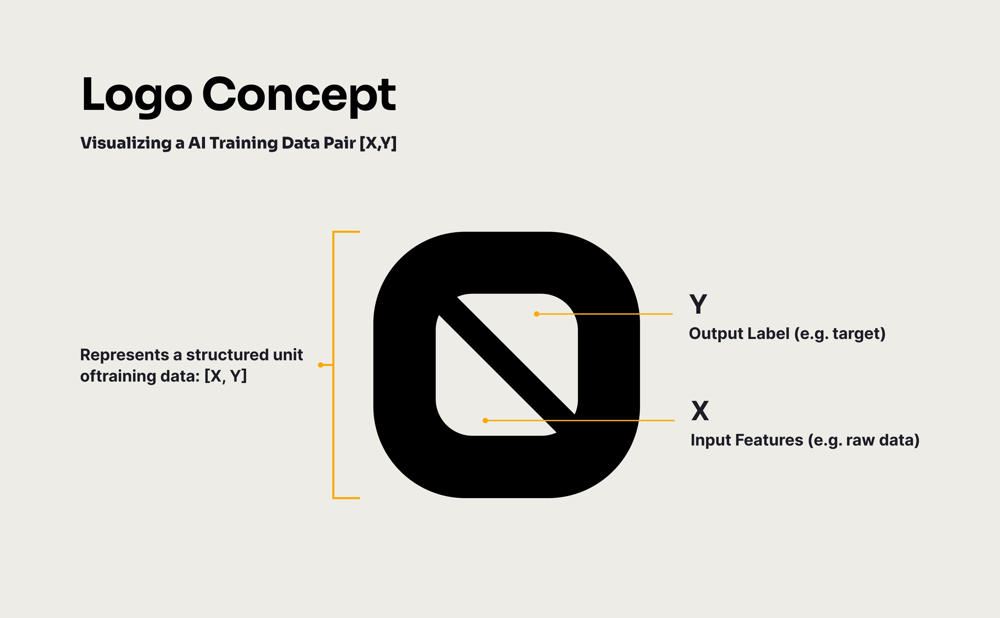
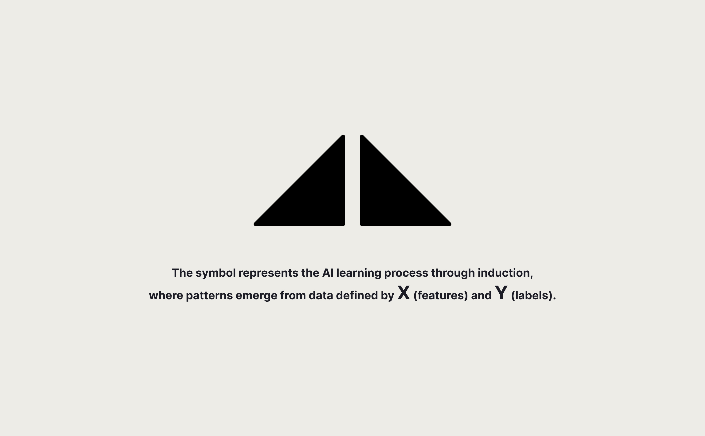
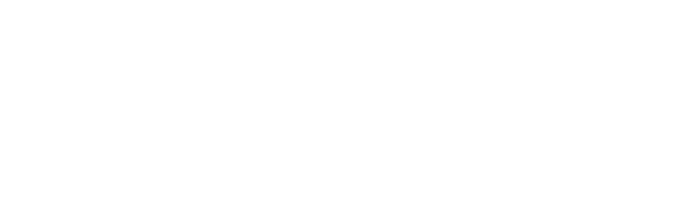
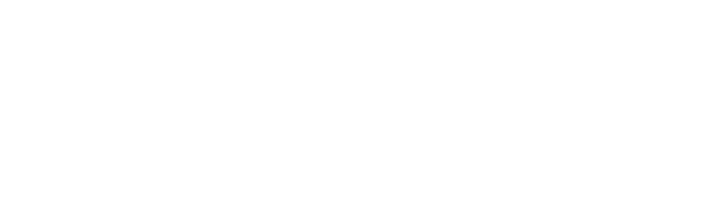
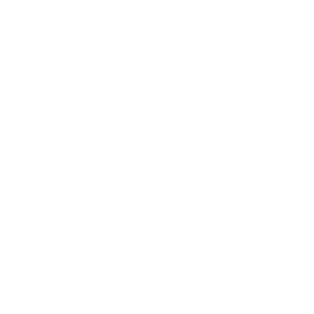
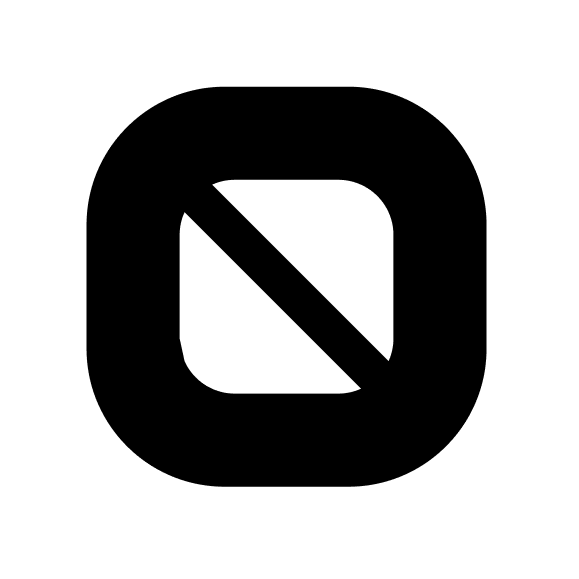

<!--  -->

# Codatta brand-kit

<!-- Badge row 1 - status -->

<!-- Badge row 2 - links and profiles -->

<!-- Badge row 3 - detailed status -->

## Brand Guide

### About
**[Codatta](https://codatta.io)** is an open, decentralized, multi-chain protocol uniting blockchain-based data infrastructure with a collaborative network of human contributors and specialized AI agents. Contributors and knowledge backers gain the opportunity to earn perpetual royalties from AI innovations powered by datasets they collectively own, transforming individual knowledge into lasting digital assets and ongoing rewards.

### Design 

### Assets
Our logo, lockups, and brand name are essential for establishing codatta's identity and brand reputation in our community. Therefore, we do sincerely ask you to use them with respect and be very mindful of the following guidelines.

#### PNG
| Symbol + Wordmark | Symbol | Wordmark  | 
| ----------------- | ------ | --------- |
|      |      |      |
|      |      |      |

#### SVG
| Symbol + Wordmark | Symbol | Wordmark  | 
| ----------------- | ------ | --------- |
|      |      |      |
|      |      |      |

#### Social Icon
| White-wrapped Black Logo |
| ------------------------ |
|  |